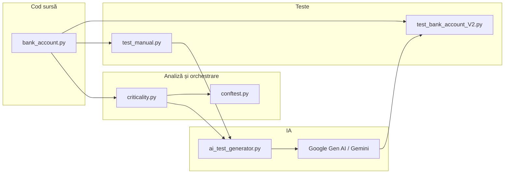
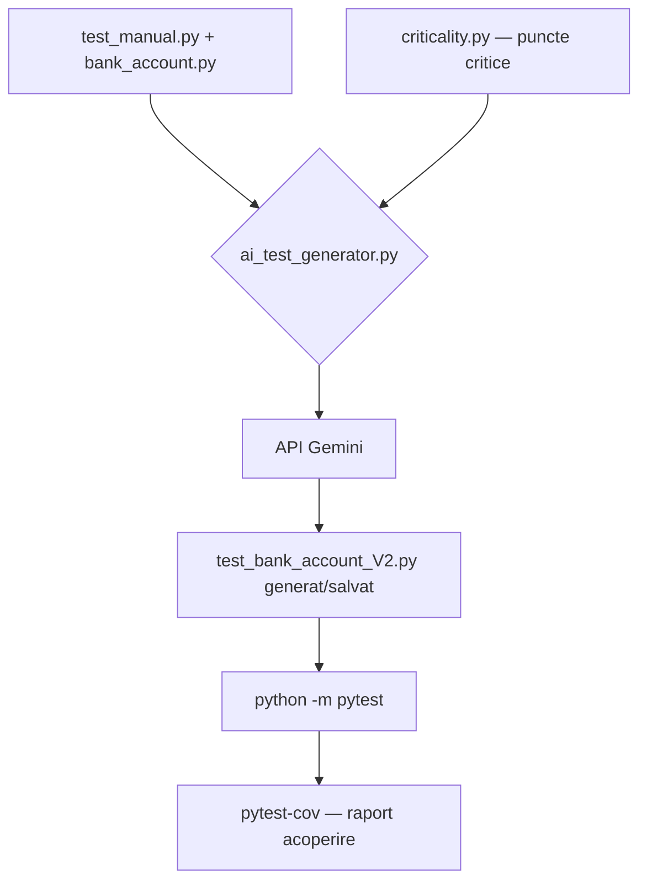
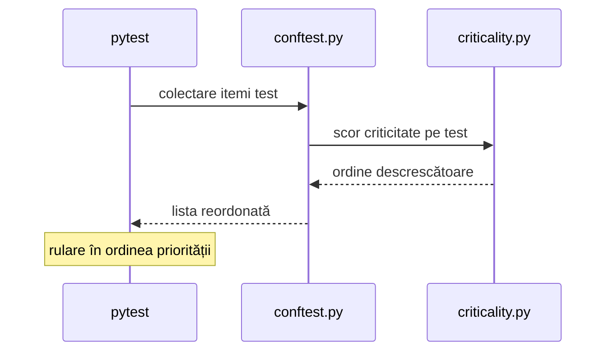

# Proiect T10 — Îmbunătățirea testării unitare cu inteligență artificială

## Date echipă și temă

| | |
|---|---|
| **Tema** | T10: utilizare IA pentru îmbunătățirea testelor unitare; identificarea punctelor critice și priorizarea testelor |
| **Membri echipă** | Niculae Cosmin, Branzea Malina |

---

## 1. Obiective

- **IA (Gemini, API Google Gen AI):** analiză și extindere a suitei de teste pornind de la teste manuale (`test_manual.py`), cu cerințe explicite (model RIP, acoperire ramuri, BVA).
- **Analiză statică a criticității:** modulul `criticality.py` evaluează metodele din codul sursă (complexitate ciclomatică aproximativă, decizii, excepții) și produce un raport folosit atât în **prompt-ul către IA**, cât și pentru **ordonarea testelor** în pytest.
- **Acoperire:** măsurare cu `pytest-cov` (instrucțiuni + ramuri), urmărind reducerea `Miss` / `BrPart` și creșterea `Cover` [1].

---

## 2. Strategii și tehnici de testare

| Strategie / tehnică | Unde se aplică în proiect |
|---------------------|---------------------------|
| **Testare unitară** | `pytest` pe clasa `BankAccount` |
| **Model RIP** (Reveal, Infect, Propagate) | Comentarii și aserțiuni în `test_bank_account_V2.py`: verificare return + stare obiect, propagarea defectelor |
| **Analiza valorilor la limită (BVA)** | Sume 0, negative, 0.01, retragere exactă / puțin peste sold |
| **Acoperire la nivel de ramură** | Condiții `amount <= 0`, `amount > self.balance`, căi de succes |
| **Priorizare după criticitate** | `conftest.py` + `criticality.py`: testele care vizează zone mai „critice” rulează mai devreme (ordonare la colectare) |
| **IA pentru completare / îmbunătățire** | `ai_test_generator.py` trimite cod sursă, teste manuale și raportul de criticitate către model |

---

## 3. Arhitectură și fluxuri (diagrame)

Diagramele sunt în **Mermaid** (randare automată pe GitHub).

### 3.1. Componente și dependențe



### 3.2. Flux: de la teste manuale la suită îmbunătățită



### 3.3. Priorizarea testelor la colectare (pytest)



---

## 4. Configurație hardware și software

### 4.1. Hardware 

| Resursă | Valoare (completați) |
|---------|----------------------|
| Procesor | AMD Ryzen 5* |
| RAM | 32 GB |
| OS | Windows 10 |


### 4.2. Software și versiuni

| Tool / pachet | Rol | Versiune verificată |
|-----------------|-----|------------------------|
| Python | Runtime | 3.13.x |
| pytest | Framework teste | 8.4.0 |
| pytest-cov | Acoperire cod | 7.1.0 |
| google-genai | Client API Gemini | 1.73.1 |
| Editor IDE | Dezvoltare | * VS Code * |


```text
python --version
python -m pip show pytest pytest-cov google-genai
```

---


## 5. Instalare și variabile de mediu

În rădăcina proiectului (recomandat: mediu virtual):

```powershell
python -m venv .venv
.\.venv\Scripts\Activate.ps1
python -m pip install -r requirements.txt
```


```powershell
$env:GOOGLE_API_KEY = "cheia-dvs"
# sau
$env:GEMINI_API_KEY = "cheia-dvs"
```

```powershell
python ai_test_generator.py
```


```powershell
$env:CRITICALITY_SOURCE = "bank_account.py"
```

---

## 6. Rularea testelor și a acoperirii

Pe Windows, `pytest` poate lipsi din PATH; folosiți modulul Python:

```powershell
python -m pytest test_bank_account_V2.py
python -m pytest test_manual.py
```

**Acoperire (instrucțiuni + ramuri):**

```powershell
python -m pytest test_bank_account_V2.py --cov=bank_account --cov-branch --cov-report=term-missing
```

**Fără reordonare după criticitate:**

```powershell
python -m pytest test_bank_account_V2.py --no-criticality-order
```

**Raport puncte critice în consolă:**

```powershell
python criticality.py bank_account.py
```

---


## 7. Comparație rezultate / tool-uri (interpretare)

### 7.1. Teste manuale vs. suită îmbunătățită (același modul `bank_account.py`)

| Metrică (`bank_account.py`) | Doar `test_manual.py` | `test_bank_account_V2.py` |
|-----------------------------|----------------------|---------------------------|
| Număr teste colectate | 3 | 13 |
| **Cover** (stmt+branch) | 81% | **100%** |
| **Miss** (linii neatinse) | 2 (ex. liniile cu `raise`) | 0 |
| **BrPart** (ramuri parțial acoperite) | 2 | 0 |

**Interpretare:** testele manuale acoperă fluxurile „fericite” și fonduri insuficiente, dar nu exercită ramurile care aruncă `ValueError` la depunere/retragere cu sumă nevalidă. Suita extinsă (BVA + excepții) elimină golurile și atinge acoperire completă pe modulul dat, ceea ce se reflectă în `Miss = 0` și `BrPart = 0` [1].

### 7.2. Rolul analizei de criticitate vs. IA

| Aspect | `criticality.py` | `ai_test_generator.py` |
|--------|------------------|------------------------|
| Tip | Heuristică pe AST (determinist) | Model lingvistic (Gemini) |
| Ieșire | Scoruri, liste de decizii/linii | Cod pytest generat/rafinat |
| Integrare | Ordinea testelor în pytest; intrare în prompt | Ieșire în `test_bank_account_V2.py` |

**Interpretare:** analiza statică oferă **prioritizare explicabilă** și structură pentru cerințe; IA oferă **varietate de scenarii și formulări de test**, sub controlul prompt-ului și al revizuirii umane.

---

## 8. Fragmente de cod relevante

### 8.1. Exemplu decizii în codul sub test

```python
# bank_account.py — ramuri: validare sumă, fonduri insuficiente
def deposit(self, amount):
    if amount <= 0:
        raise ValueError("Suma depusă trebuie să fie pozitivă.")
    self.balance += amount
    return self.balance
```

### 8.2. Hook de priorizare (idee)

```python
# conftest.py — reordonare după scor din criticality.py
def pytest_collection_modifyitems(config, items):
    if config.getoption("--no-criticality-order"):
        return
    from criticality import prioritize_pytest_items
    prioritize_pytest_items(items)
```

---

## 9. Referințe bibliografice

[1] Python Software Foundation, *Coverage.py — Measurement*, documentație pytest-cov și branch coverage. Disponibil: https://coverage.readthedocs.io/ (accesat 2026).

[2] Mermaid project, *Diagram Syntax*, pentru diagrame textuale exportabile. Disponibil: https://mermaid.js.org/ (accesat 2026).

[3] Cerințe curs — documentație proiect: diagrame cu tool-uri dedicate (ex. diagrams.net, Lucidchart, yEd, Visio); fără imagini scanate/fotografiate.

[4] Google, *Google Gen AI SDK for Python* (`google-genai`), utilizat pentru apelul modelului Gemini. Disponibil: https://googleapis.github.io/python-genai/ (accesat 2026).

[5] Myers, G. J.; Sandler, C.; Badgett, T. *The Art of Software Testing* (ed. relevantă) — principii RIP, testare la limite (concepte BVA), citate în strategia din §2.

---

## 12. Licență și academic integrity

Proiect realizat în scop didactic. Cheile API nu trebuie incluse în repository; folosiți variabile de mediu. Conținutul generat de IA a fost revizuit pentru corectitudine și conformitate cu specificațiile cursului.
